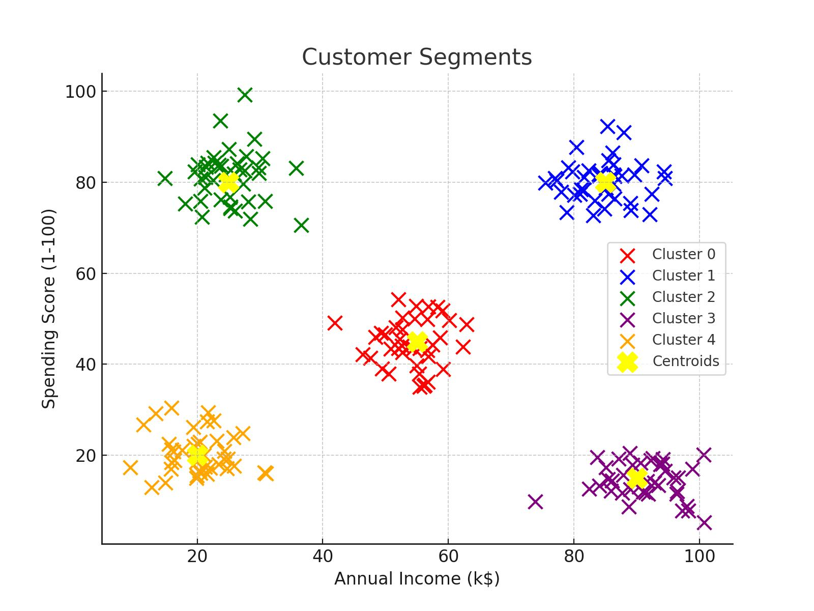

# K-Means Clustering Project to segment retail store customers based on their purchase history
A K-Means Clustering project to segment retail store customers based on their purchase history. Helps identify customer groups for targeted marketing and personalization strategies.


[](LICENSE)

## Visualization of K-Means Clustering
 


## 📌 Project Overview
This data science project implements **unsupervised machine learning** to segment mall customers into distinct groups based on their purchasing behavior and income levels. The analysis helps businesses develop **targeted marketing strategies** to maximize customer engagement and revenue.

## 📊 Dataset Features
| Feature | Description | Type |
|---------|-------------|------|
| CustomerID | Unique identifier | Integer |
| Gender | Customer's gender | Categorical |
| Age | Customer's age | Integer |
| Annual Income (k$) | Yearly income in thousands | Continuous |
| Spending Score (1-100) | Mall's spending evaluation | Ordinal |

## 🔍 Methodology
### 1. Data Preprocessing
- Selected relevant features: `Annual Income` and `Spending Score`
- Scaled features for optimal clustering performance

### 2. Optimal Cluster Determination
```python
wcss = []
for i in range(1, 11):
    kmeans = KMeans(n_clusters=i, init='k-means++', random_state=42)
    kmeans.fit(X)
    wcss.append(kmeans.inertia_)
```
*Elbow method implementation to determine k=5*

### 3. K-Means Clustering
Implemented with k=5 clusters
Visualized results with distinct colors for each segment


### !! Happy Learning !!
